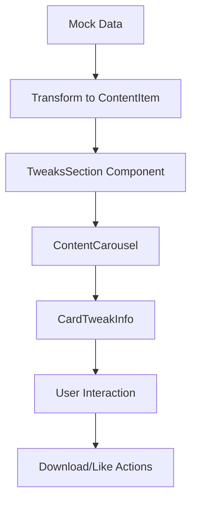

# Tweaks System Documentation

## 🎯 Overview

The Tweaks System allows users to safely optimize their Windows systems through curated registry modifications, batch scripts, and PowerShell commands. The system emphasizes **safety**, **transparency**, and **user education**.

## 🏗️ Architecture

### Core Components

```
📁 types/tweak.ts           # TypeScript interfaces & types
📁 constants/tweaks-mock.ts # Mock data for development
📁 lib/transformers/        # Data transformation utilities
📁 components/dashboard/    # UI components
   ├── tweaks-section.tsx           # Main tweaks container
   ├── card-tweak-info.tsx         # Individual tweak cards
   └── categories-carrousel.tsx    # Reusable carousel
```

## 📊 Data Structure

### Risk Assessment System

| Level | Description | Icon | Color |
|-------|-------------|------|-------|
| `minimal` | No system impact | ✅ | Green |
| `low` | Minor changes, easily reversible | 🛡️ | Blue |
| `medium` | Moderate changes, some risk | ⚠️ | Yellow |
| `high` | Major changes, BSOD risk | ⚠️ | Orange |
| `critical` | Dangerous, expert only | ❌ | Red |

### Device Compatibility

- **Desktop Only**: Tweaks that may harm laptop battery life
- **Laptop Only**: Battery optimization tweaks
- **Both**: Universal tweaks safe for all device types

### Windows Version Support

- **Windows 10**: Specific to Win10 registry/features
- **Windows 11**: Specific to Win11 registry/features
- **Both**: Compatible with both versions

## 🔧 File Types Supported

| Extension | Description | Use Case |
|-----------|-------------|----------|
| `.reg` | Registry files | System settings modification |
| `.bat` | Batch scripts | Command-line operations |
| `.ps1` | PowerShell scripts | Advanced system management |
| `.cmd` | Command scripts | Simple system commands |
| `.msi` | Installer packages | Software installations |

## 🛡️ Safety Features

### 1. Risk Level Warnings
- Clear visual indicators for danger levels
- Detailed risk descriptions
- Mandatory warnings for high/critical tweaks

### 2. Compatibility Checking
- Device type validation (desktop/laptop)
- Windows version compatibility
- Hardware requirement checks

### 3. Reversal Information
- Every tweak includes reversal instructions
- Backup recommendations
- Recovery procedures

### 4. Success Rate Tracking
- Real-world success statistics
- User feedback integration
- Community validation

## 🎨 UI Components

### TweakCard Features

```typescript
// Key visual elements
- Risk level badge with color coding
- Device compatibility icons
- Requirements badges (Admin, Restart, etc.)
- Impact indicators (Battery, Performance, Security)
- Author verification status
- Statistics (downloads, likes, rating, success rate)
- File size and extension display
```

### Interactive Elements

- **Download Button**: Initiates secure file download
- **Like Button**: Community engagement
- **Risk Warnings**: Context-aware alerts for dangerous tweaks
- **Compatibility Display**: Device and Windows version indicators

## 📈 Statistics & Metadata

### Tracked Metrics
- `downloads_count`: Total downloads
- `likes_count`: User likes/favorites
- `views_count`: Page views
- `rating`: 1-5 star rating
- `reviews_count`: Number of reviews
- `success_rate`: Percentage of successful applications

## 🔄 Data Flow



## 🚀 Current Implementation Status

### ✅ Completed
- [x] Complete TypeScript type system
- [x] Comprehensive mock data (6 realistic tweaks)
- [x] Risk level assessment system
- [x] Device compatibility checking
- [x] UI components with safety warnings
- [x] Transformer utilities
- [x] Carousel integration
- [x] File size/extension handling

### 🔄 In Progress
- [ ] API integration (replacing mock data)
- [ ] Download functionality
- [ ] User authentication for likes/ratings
- [ ] Database schema for Supabase

### 📋 Planned Features
- [ ] User reviews and ratings
- [ ] Tweak categories and filtering
- [ ] Search functionality
- [ ] Conflict detection between tweaks
- [ ] Prerequisite tweak validation
- [ ] Automated backup creation
- [ ] System compatibility scanning
- [ ] Tweak scheduling and automation

## 🎯 Example Tweaks Included

1. **Disable Windows Telemetry** (Privacy, Low Risk)
2. **Ultimate Gaming Performance Boost** (Gaming, Medium Risk)
3. **Laptop Battery Life Maximizer** (Battery, Low Risk)
4. **DANGEROUS: Kernel-Level Performance Hack** (Performance, Critical Risk)
5. **Windows 11 Classic Start Menu Restore** (Appearance, Minimal Risk)
6. **Network Speed Optimization** (Network, Medium Risk)

## 🔒 Security Considerations

### Content Validation
- All tweak content is manually reviewed
- Registry modifications are validated
- Scripts are tested in isolated environments
- Malware scanning for all files

### User Protection
- Clear risk communication
- Mandatory warnings for dangerous tweaks
- Reversal instructions always provided
- Success rate transparency

### Authentication
- Verified author system
- Community reporting mechanisms
- Admin moderation capabilities

## 🎨 Design Principles

### Visual Hierarchy
1. **Risk Level** - Most prominent visual element
2. **Compatibility** - Clear device/Windows indicators
3. **Impact** - What the tweak affects
4. **Statistics** - Social proof and reliability

### Color Coding
- **Green**: Safe operations
- **Blue**: Minor changes
- **Yellow**: Caution required
- **Orange**: High risk
- **Red**: Critical/dangerous

### Information Architecture
- **Primary**: Title, description, risk level
- **Secondary**: Compatibility, requirements
- **Tertiary**: Statistics, author info
- **Actions**: Download, like buttons

## 📱 Responsive Design

- **Mobile**: Single column, larger touch targets
- **Tablet**: 2-column grid layout
- **Desktop**: 4-column carousel display
- **Large**: Maintains 4-column with larger spacing

## 🧪 Testing Strategy

### Risk Level Testing
- Test each risk level with appropriate visual treatment
- Verify warning systems for high/critical tweaks
- Validate compatibility checking logic

### Compatibility Testing
- Test device type filtering
- Verify Windows version compatibility
- Check requirement badge display

### User Experience Testing
- Download flow testing
- Like/unlike functionality
- Carousel navigation
- Mobile responsiveness

---

*Last updated: February 2024*
*Architecture follows Screaming Architecture principles*
